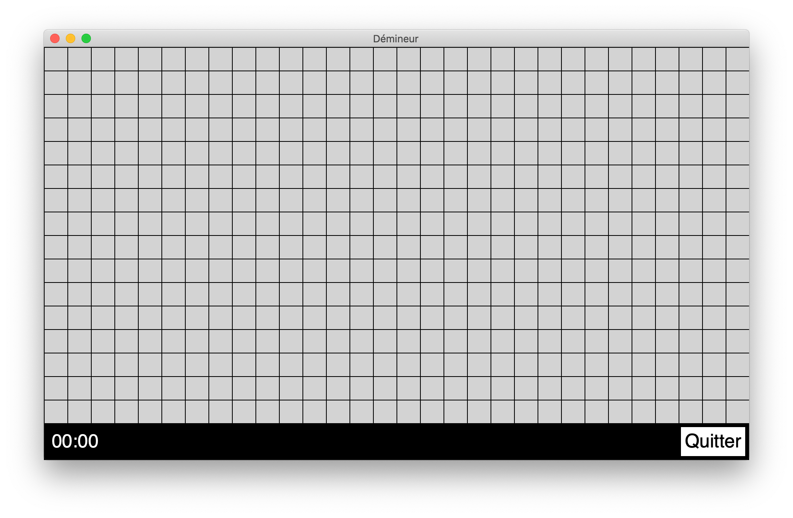
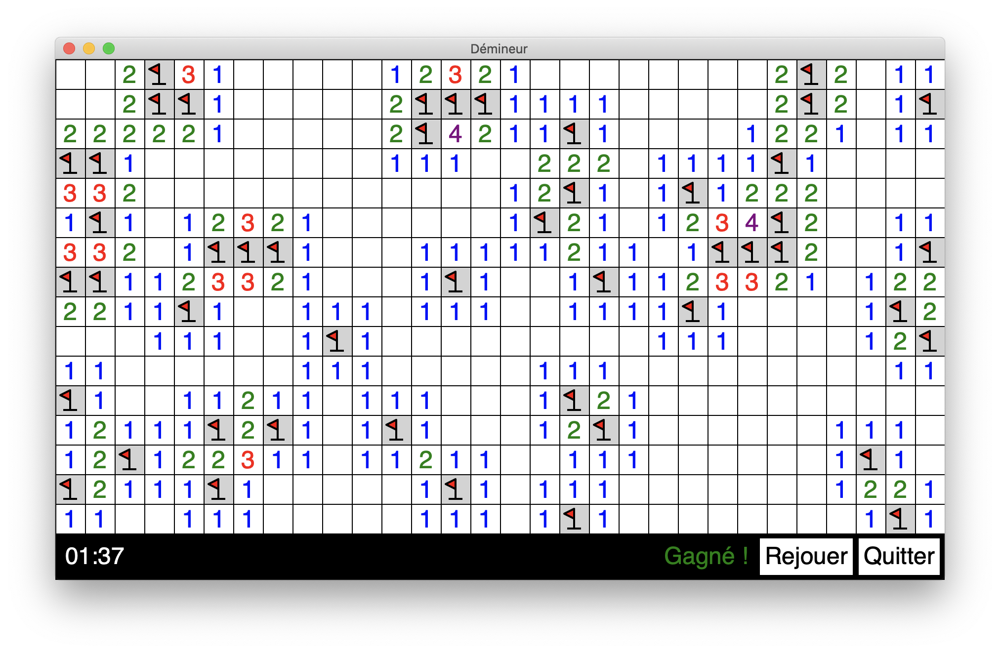
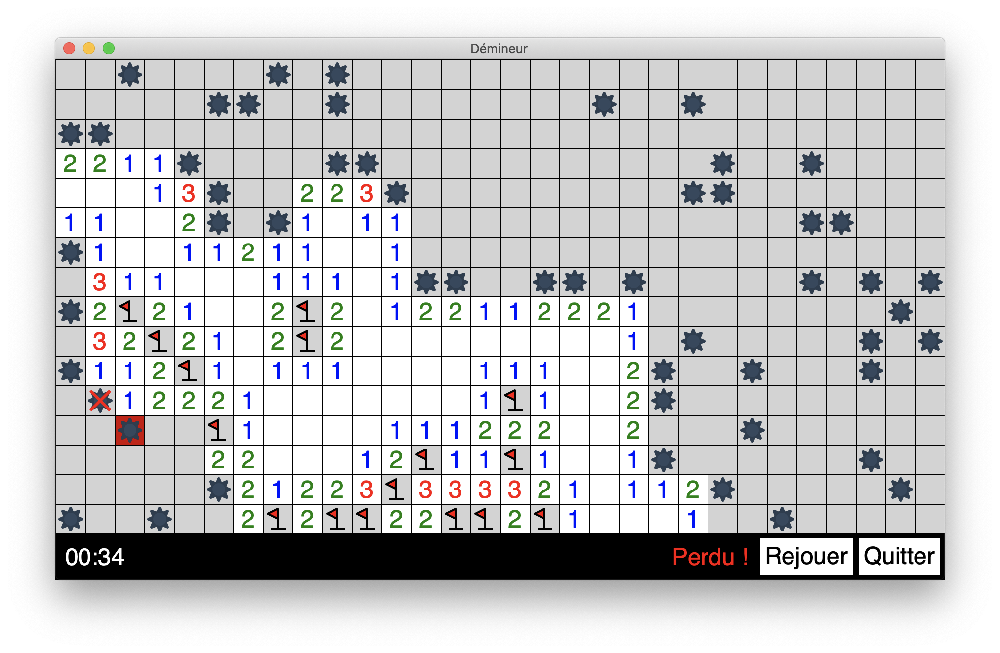

# MineSweeper

This game is written in Python using the `upemtk` library from the University of Marne-la-Vallée in France.

I edited the library to add an event listener system, allowing me to click a button at any time regardless of the program throttling.

## Rules

The goal is to find all the mines hidden in the grid. To do so, you have to click cells.
- If a cell contains a mine, game is over.
- If a cell is surrounded by one or more mines, it displays in itself the amount of surrounding mines.
- Otherwise, it discovers adjacent cells.

## Screenshots

